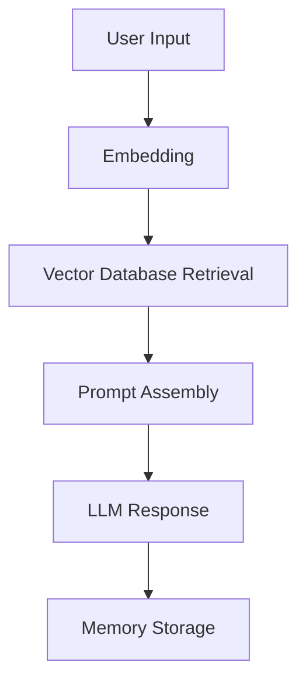

# llm-memory-agent
A long-term memory AI agent with persistent semantic memory and retrieval-augmented context management.

## Project Goal
This project aims to build a long-term memory AI agent.

The agent can:
- chat with users
- store important memories
- retrieve past conversations
- maintain long-term context
- support future extensions such as tools and planning

The project is designed as a learning-oriented LLM system for studying:
- memory systems
- retrieval augmented generation (RAG)
- agent workflows
- long-context interaction

## Workflow

1. User sends a message
2. The system embeds the message
3. Relevant memories are retrieved
4. Context is injected into the prompt
5. LLM generates a response
6. Important information is stored into memory

## Current Functionality
- [x] Basic chat interface
- [ ] Long-term memory
- [ ] Vector database retrieval
- [ ] Conversation summarization
- [ ] Tool usage

## System Structure (Design Goal)
The system currently contains the following modules:

- Chat Module
  Handles user interaction.

- LLM Module
  Connects to locally deployed LLMs through Ollama.

- Memory Module
  Stores and retrieves conversation history.

- Embedding Module
  Converts text into vector embeddings.

- Retrieval Module
  Searches relevant memories from the vector database.

## Tech Stack
- Python
- Ollama
- Llama/Qwen
- LangChain
- ChromaDB
- HuggingFace Transformers
- sentence-transformers
- VSCode

## Road Map

### V1
- Basic chat system
- Local LLM integration
- Conversation storage

### V2
- Long-term memory
- Embedding retrieval
- Semantic search

### V3
- Tool usage
- File reading
- Multi-session memory

### V4
- Basic task planning
- Experimental multi-agent collaboration

## TO-DO
- [x] Set up project structure
- [x] LLM integration
- [x] Build chat loop
- [x] Save conversation history
- [ ] Add embedding model
- [ ] Integrate ChromaDB

## Design Philosophy
This project focuses on exploring memory-centric LLM agent architectures.

Instead of relying solely on larger foundation models, the system investigates how persistent memory, retrieval mechanisms, and modular workflows can enhance long-context interaction and agent capability.

## Future Research Directions

Possible future directions include:

- Memory compression
- Long-context optimization
- Reflection and self-evaluation
- Tool-augmented reasoning
- Persistent agent identity
- Multi-agent interaction

## How to Run
python app/main.py
